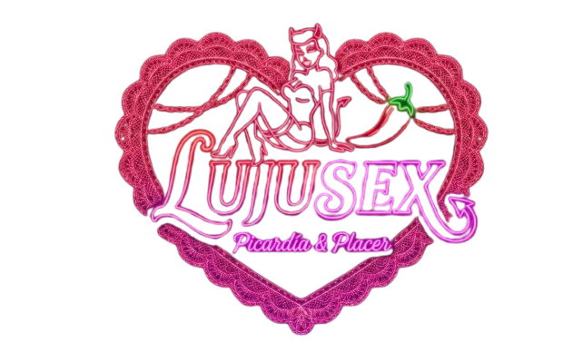

# 🎨 Guía de Estilos - LujuSex



---

## 🎯 Identidad Visual

**Tienda online moderna y sofisticada**  
Diseño oscuro, elegante y de calidad para adultos conscientes.

---

## 🎨 Paleta de Colores

### Color Principal

**Rosa Magenta: #e83e8c**

- Botones principales
- Enlaces destacados
- Hover en elementos
- Acentos visuales

### Colores Secundarios

| Color | Código | Uso |
|-------|--------|-----|
| 🔵 Azul | #3b82f6 | Categorías |
| 🟢 Verde | #10b981 | Crear, éxito, acciones positivas |
| 🟣 Púrpura | #a855f7 | Atributos |
| 🟠 Naranja | #f97316 | Variaciones |
| 🟡 Amarillo | #eab308 | Datos de prueba |

### Fondos

| Color | Código | Uso |
|-------|--------|-----|
| Muy Oscuro | #151521 | Fondo de página |
| Superficie | #1e1e2d | Tarjetas, contenedores |
| Borde Sutil | #2b2b40 | Divisiones, bordes |

### Estados

- ✅ **Éxito** → Verde
- ⚠️ **Alerta** → Ámbar  
- ❌ **Error** → Rojo
- ℹ️ **Información** → Azul

---

## 🔤 Tipografía

### Fuente Principal

**Plus Jakarta Sans**

Moderna, legible, sofisticada.

### Jerarquía de Tamaños

| Tipo | Tamaño | Uso |
|------|--------|-----|
| **H1** | Muy Grande | Títulos principales de página |
| **H2** | Grande | Títulos de secciones |
| **H3** | Mediano | Subtítulos y categorías |
| **Cuerpo** | Normal | Texto descriptivo |
| **Pequeño** | Pequeño | Etiquetas y notas |

---

## 📏 Espaciado

**Principio:** El espacio en blanco respira.

### Dentro de elementos
- Alrededor de texto: **24px a 32px**

### Entre elementos
- Entre tarjetas: **16px a 24px**
- Entre secciones: **32px a 48px**
- Entre párrafos: **8px a 16px**

---

## 🎯 Categorías de Productos

| Categoría | Color | Emoji |
|-----------|-------|-------|
| 🎁 Juguetes | Rosa `#e83e8c` | Diversión |
| 👗 Apparel | Azul `#3b82f6` | Moda |
| 💧 Lubricantes | Verde `#10b981` | Bienestar |
| ⚙️ Accesorios | Naranja `#f97316` | Complementos |

---

## 🧩 Componentes Visuales

### Botones

**PRIMARIO** (Rojo/Rosa)
- Para acciones principales
- Ejemplo: Comprar, Enviar, Confirmar

**SECUNDARIO** (Contorno Rosa)
- Para acciones alternas
- Ejemplo: Cancelar, Ir atrás

**PEQUEÑO** (Solo texto)
- Para acciones menores
- Ejemplo: Ver más, Leer

### Tarjetas

- Borde gris oscuro sutil
- Fondo oscuro
- Esquinas redondeadas
- Sombra al pasar el ratón

### Inputs (Formularios)

- Fondo oscuro
- Borde gris sutil
- Rosa en foco
- Placeholder gris

### Alertas

**Éxito:** Fondo verde oscuro, texto verde  
**Error:** Fondo rojo oscuro, texto rojo  
**Alerta:** Fondo ámbar oscuro, texto ámbar  

---

## 📱 Diseño Responsive

### Tamaños de Pantalla

| Dispositivo | Ancho | Características |
|-------------|-------|-----------------|
| 📱 Móvil | < 640px | Una columna, botones grandes |
| 📱 Tablet | 640px - 1024px | Dos columnas, espacios medios |
| 🖥️ Desktop | > 1024px | Tres+ columnas, espacios amplios |

### Regla Principal

**Mobile First:** Diseñar para móvil primero, luego crecer hacia desktop.

---

## ✨ Comportamiento Visual

### Cuando pasas el ratón (Hover)
- Botones cambian color
- Tarjetas suben sombra
- Enlaces se subrayan
- Cambio suave y elegante

### Cuando haces clic (Active)
- Color más oscuro
- Feedback visual inmediato

### Cuando cargas (Loading)
- Icono rotativo sutil
- Mensaje "Cargando..."

### Cuando está deshabilitado (Disabled)
- Grisáceo y opaco
- Cursor "no permitido"

---

## 🎯 Iconos

**Librería:** Material Icons - Modernos y consistentes

Ejemplos:
- ➕ Agregar
- ✏️ Editar  
- 🗑️ Eliminar
- 🛒 Carrito
- 👤 Perfil
- 🔍 Buscar
- ❌ Cerrar

---

## ✅ SÍ Haz esto

✅ Usa rosa para atraer atención  
✅ Mantén espacios entre elementos  
✅ Móvil primero, luego desktop  
✅ Botones grandes y clickeables  
✅ Texto legible y contrastado  
✅ Consistencia en toda la web  
✅ Respeta colores por categoría  

---

## 🚫 NO Hagas esto

❌ Colores muy claros en fondo oscuro  
❌ Botones demasiado pequeños  
❌ Textos apretados sin respiro  
❌ Efectos que ralenticen la web  
❌ Muchos colores diferentes  
❌ Ignorar el diseño en móvil  
❌ Saltarse espacios

---

## 🎨 Resumen Visual

```
TEMA:        Oscuro y moderno
MOOD:        Profesional, accesible, sofisticado
PÚBLICO:     Adultos con gusto
SENSACIÓN:   Confianza y calidad
COLOR CLAVE: Rosa/Magenta
FUENTE:      Plus Jakarta Sans
```

---


